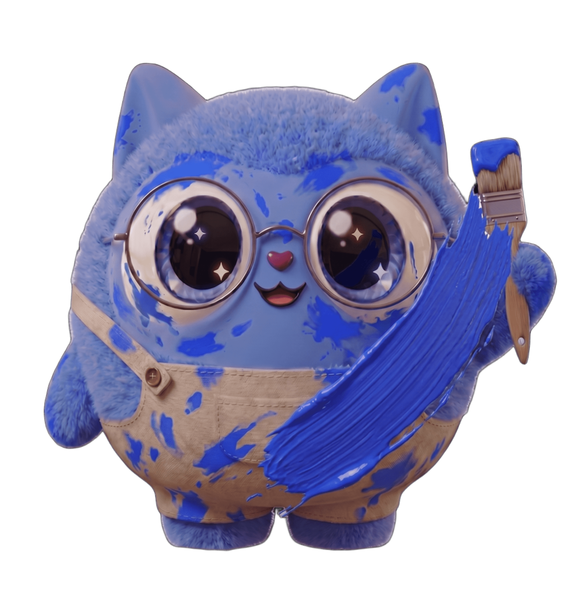
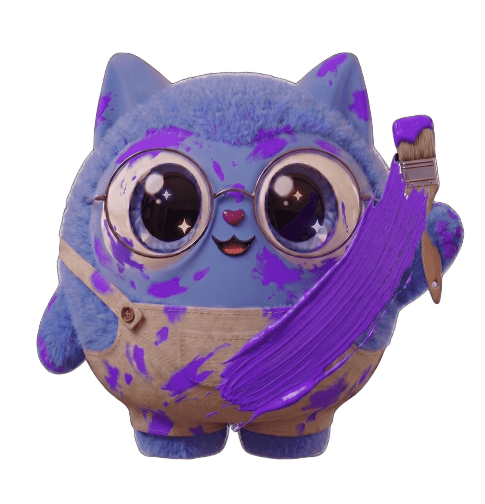
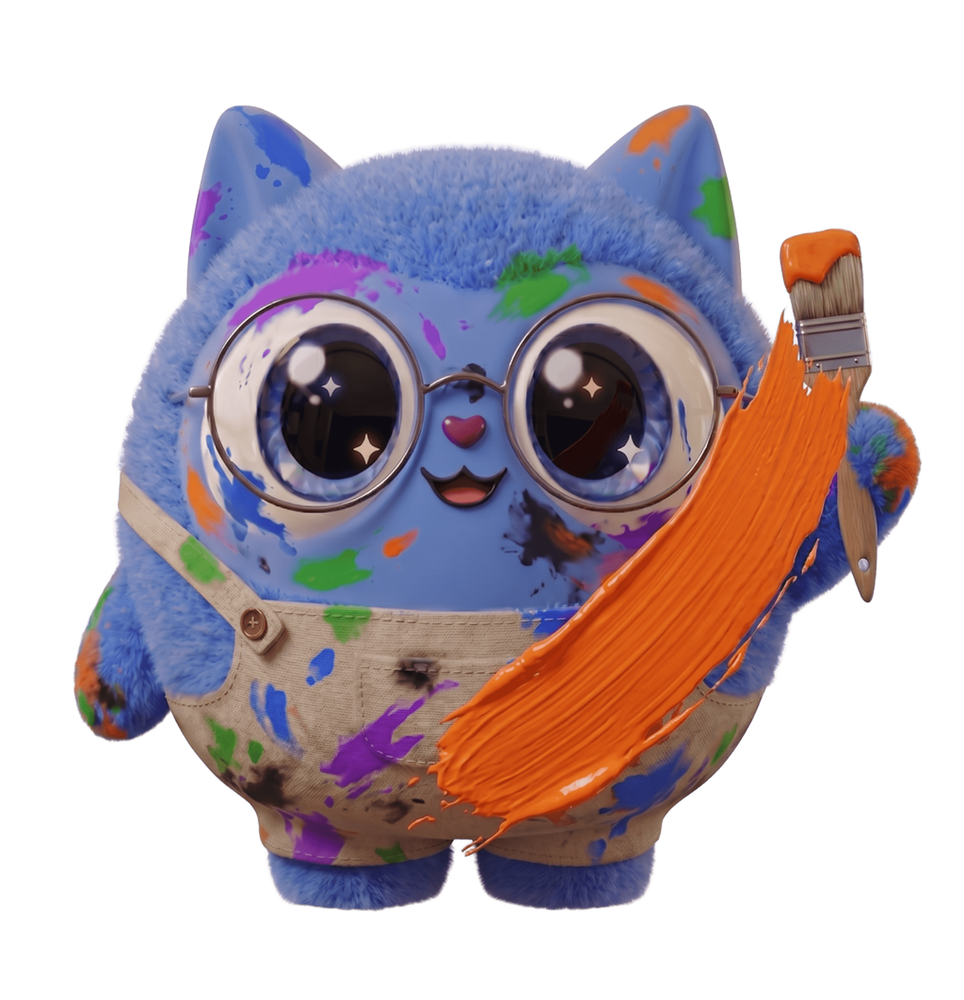

 
 

# 🎨 Guia de Design 

Bem-vindo ao guia de estilo oficial. Este documento detalha os elementos visuais, a paleta de cores e a tipografia que compõem a identidade do projeto.

---

##  Identidade Visual

##  O Conceito do Dente-de-Leão

A identidade visual do SOPRO não foi escolhida por acaso. Ela é fundamentada na metáfora do **Dente-de-Leão**: uma flor que, ao receber um sopro sutil, desfaz-se em dezenas de sementes voadoras carregadas pelo vento para florescer em novos lugares.

 **O Sopro como Ação:** O menor esforço físico do usuário — um sopro — aciona o sistema.
 **As Sementes como Voz:** Cada semente espalhada representa uma palavra, uma intenção ou uma conexão estabelecida que supera as barreiras físicas do mutismo.

## 🎨 Paleta de Cores

Nossa paleta foi selecionada para oferecer um contraste vibrante e moderno, mantendo a legibilidade e a acessibilidade.

| Cor | Hexadecimal | Descrição | Exemplo |
| :--- | :--- | :--- | :--- |
| **Azul** | `#1A53FF` |  Garante precisão e estabilidade tecnológica, transmitindo segurança e total confiabilidade na interface. | <kbd></kbd> |
| **Roxo** | `#9333EA` | Traz empatia e conexão humana ao design, equilibrando a frieza técnica com sensibilidade profunda.| <kbd></kbd> |
| **Verde** | `#30BD30` | Remete à saúde e ao equilíbrio vital, funcionando como um ponto de harmonia.| <kbd></kbd> |
| **Laranja** | `#F97316` | Cor quente que gera acolhimento imediato. Atua como o tom chamativo de alerta, sem causar ansiedade. | <kbd></kbd> |
| **Preto** | `#1D252A` | Tipografia  | <kbd></kbd> |
| **Branco** | `#FAFCFF` | Tipografia | <kbd></kbd> |

## 📐 Tipografia & Hierarquia Visual

Para garantir consistência, legibilidade e um forte apelo visual em toda a interface do projeto, estabelecemos um sistema de tipografia baseado em duas fontes geométricas modernas: **Montserrat** e **Poppins**.

---

### 🖋️ Fontes Escolhidas

| Aplicação | Família Tipográfica | Estilo Geral | Propósito |
| :--- | :--- | :--- | :--- |
| **Títulos & Headings** | `Montserrat` | Sans-serif Geométrica | Impacto, presença e forte hierarquia visual. |
| **Corpo & Rótulos** | `Poppins` | Sans-serif Geométrica | Fluidez de leitura, clareza e excelente renderização em telas. |

---

### 📐 Escala Tipográfica (Style Guide)

#### 🔹 Montserrat — Títulos e Destaques
*Utilizada estritamente para capturar a atenção do usuário e segmentar as seções da aplicação.*

| Elemento | Tamanho | Peso (Weight) | Uso Recomendado |
| :--- | :--- | :--- | :--- |
| **`H1 (Display)`** | 48px a 60px | ExtraBold (800) | Títulos principais e telas de destaque. |
| **`H2 (Seção)`** | 32px a 40px | Bold (700) | Títulos de seções e componentes maiores. |
| **`H3 (Subtítulo)`** | 24px a 28px | SemiBold (600) | Subtítulos de blocos e cards. |

 

#### 🔸 Poppins — Texto e Interface
*Utilizada para toda a parte de conteúdo, textos longos e elementos interativos.*

| Elemento | Tamanho | Peso (Weight) | Uso Recomendado |
| :--- | :--- | :--- | :--- |
| **`Lead (Intro)`** | 20px | Medium (500) | Textos de introdução e destaques editoriais. |
| **`Body (Corpo, padrão)`** | 16px a 18px | Regular (400) | Conteúdo principal, parágrafos e textos longos. |
| **`Small (Apoio)`** | 14px | Regular (400) | Legendas, textos de apoio e microcópias. |
| **`Botão / CTA`** | 16px | SemiBold (600) | Textos internos de botões e chamadas para ação. |
---

---
Criado com 💙 pela equipe de Design.

