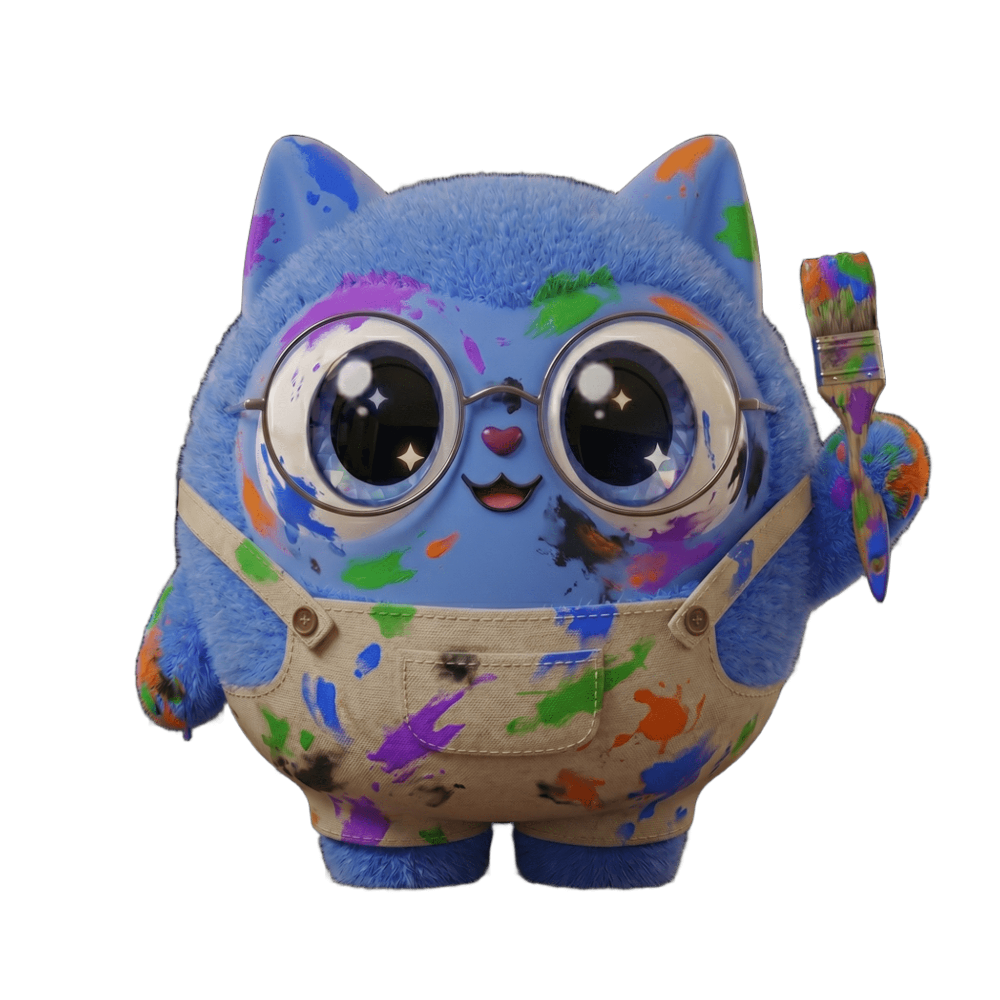

 
 

# 🎨 Guia de Design - 

Bem-vindo ao guia de estilo oficial. Este documento detalha os elementos visuais, a paleta de cores e a tipografia que compõem a identidade do projeto.

---

## 🔵 Identidade Visual

<table>
  <tr>
    <td width="50%">
      
    </td>
    <td width="50%" valign="top">
      <h3></h3>
      

      
 .

      
   
  </tr>
</table>

---

## 🎨 Paleta de Cores

Nossa paleta foi selecionada para oferecer um contraste vibrante e moderno, mantendo a legibilidade e a acessibilidade.

| Cor | Hexadecimal | Descrição | Exemplo |
| :--- | :--- | :--- | :--- |
| **Azul** | `#1A53FF` |  |  |
| **Roxo** | `#9333EA` | |  |
| **Verde** | `#30BD30` |  |  |
| **Laranja** | `#F97316` |  |  |
| **Preto** | `#1D252A` | |  |
| **Branco** | `#FAFCFF` | |  |

- `palette.json` (Para integração com Tailwind/Styled Components)

---
Criado com ❤️ pela equipe de Design.
